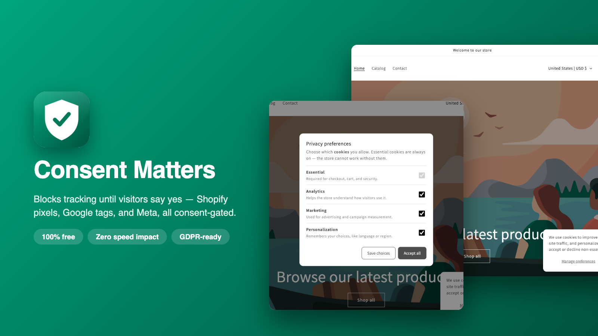
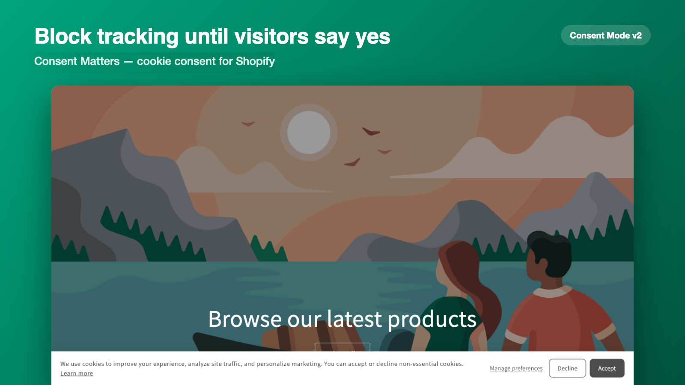
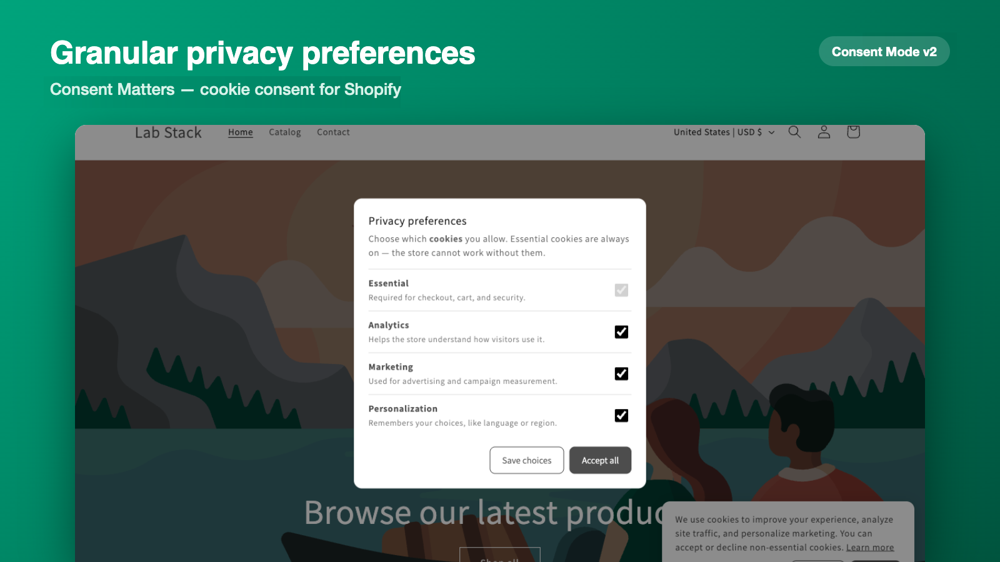
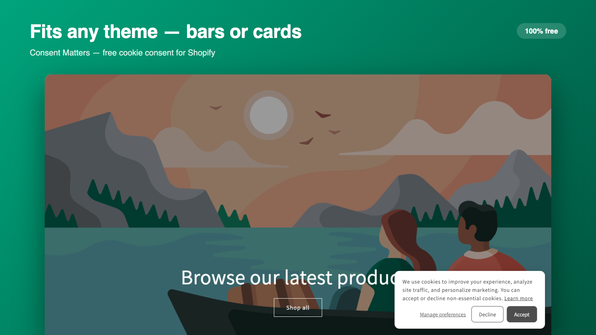
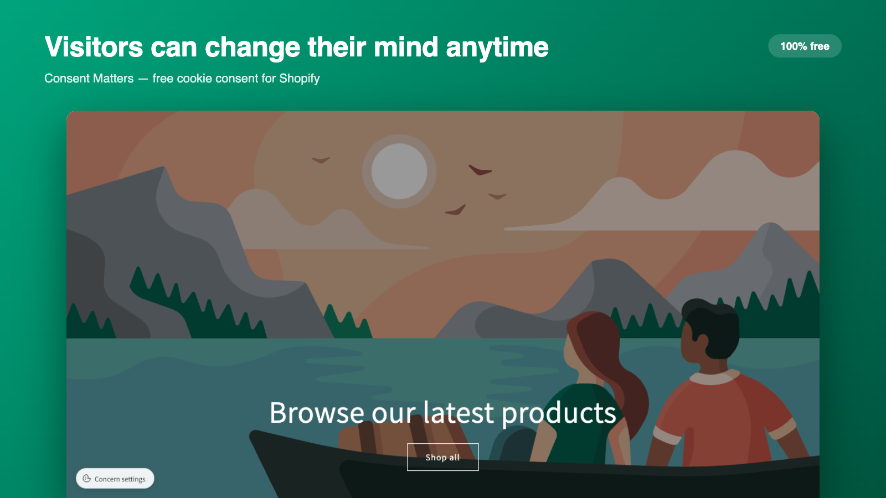
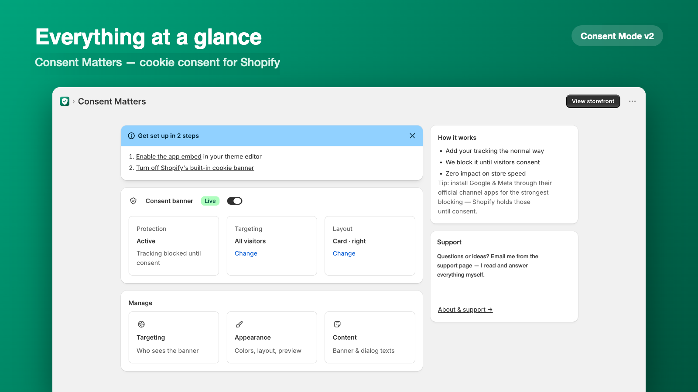
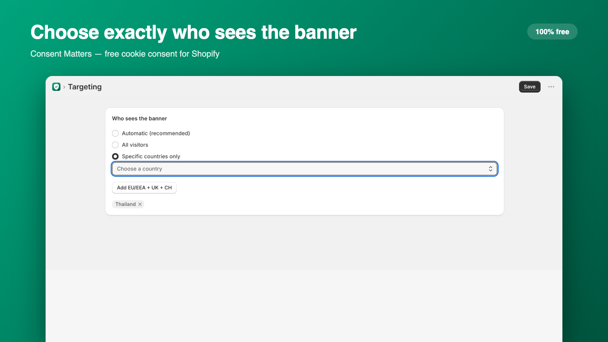
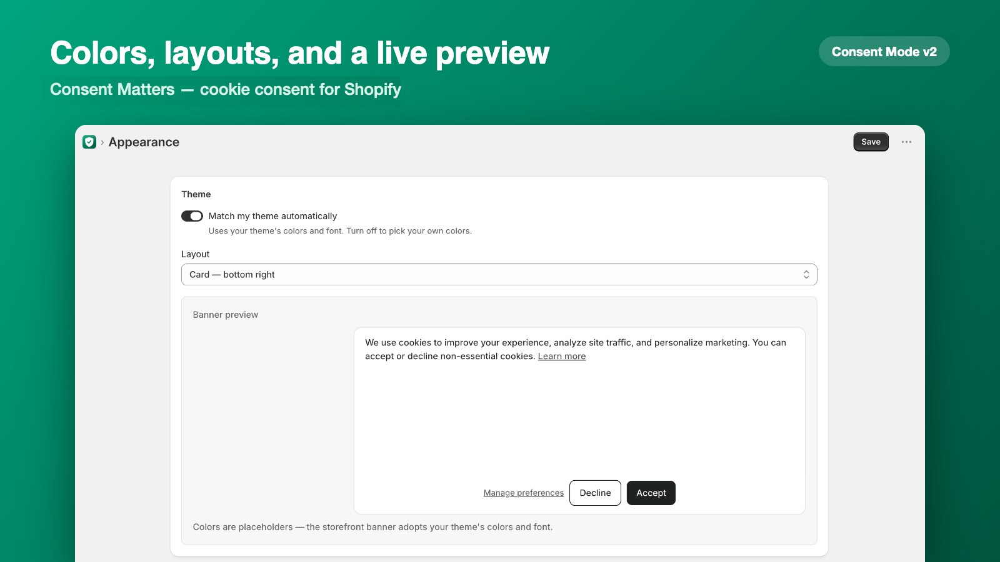

# Consent Matters

**Free, lightweight cookie consent for Shopify — blocks tracking until
visitors say yes.**

⭐ *If Consent Matters saves you money, a star helps other merchants
find it.*

---

## Why merchants pick it

- 🛡️ **Real blocking, not decoration** — Shopify analytics, Google tags,
  and Meta pixels stay paused until the visitor consents
- 🎛️ **Granular choices** — visitors pick Analytics, Marketing, and
  Personalization separately, and can change their mind anytime
- 🎨 **Fits any theme** — auto-matches your colors and font, or go fully
  custom; bar and card layouts with a live preview
- ✍️ **Every word is yours** — banner and dialog texts are editable with
  bold, italics, and links
- ⚡ **Zero speed impact** — a tiny script, no storefront server calls
- 🌐 **Honors Global Privacy Control** automatically
- 💯 **Free forever** — every feature included, no plans, no trials

## Screenshots

| | |
| --- | --- |
|  |  |
|  |  |
|  |  |

## Installation

Coming to the Shopify App Store — free. Until then, the app is in
private beta.

1. Install from the App Store (link coming soon)
2. Enable the **Consent Matters banner** app embed in your theme editor
3. Turn off Shopify's built-in cookie banner (Settings → Customer
   privacy) — done ✨

## Contributing

Development happens in a private repository; this repository carries
production releases. The best ways to contribute:

- 💡 **Feature ideas & bug reports** — open an [issue](../../issues)
- 🗣️ **Spread the word** — tell a merchant friend, leave a review once
  it's on the App Store, or drop a ⭐

## Support the developer

Consent Matters is free forever — built as a gift to the Shopify
community. If it saves you money and you'd like to give something back,
see **[DONATIONS.md](DONATIONS.md)**. Entirely optional — everything
stays free either way.

## About the developer

Built by **Chan Lay** — a full-stack developer from Myanmar 🇲🇲 building
lightweight, merchant-friendly apps for Shopify.

[GitHub](https://go.myanmarnode.com/fYAqD25) ·
[LinkedIn](https://go.myanmarnode.com/NsSgYYg)
